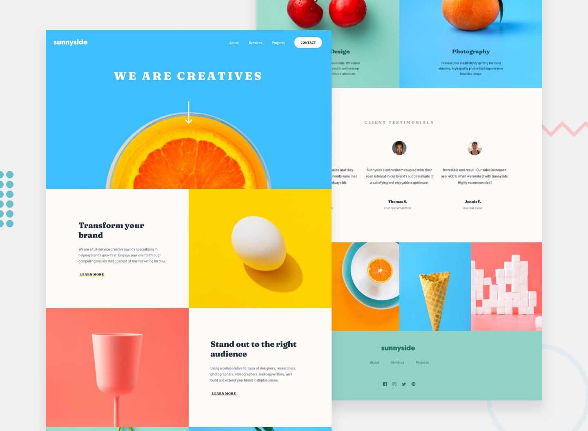
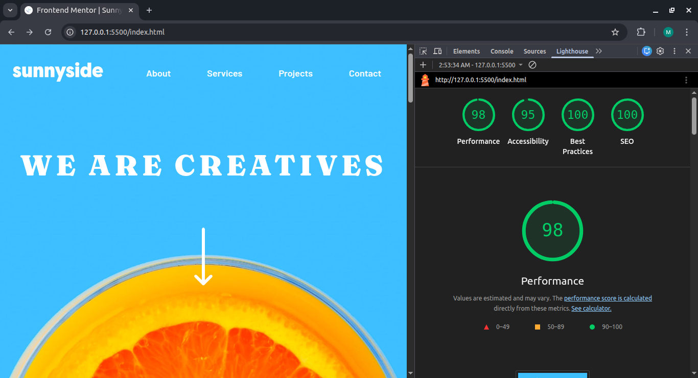

# Sunnyside Agency Landing Page

## 🌍 Links
- **Live Site URL:** [View Live Site](https://menna-rashad.github.io/sunnyside-agency-landing-page-main/)
- **Frontend Mentor Solution:** [View Solution](https://www.frontendmentor.io/solutions/responsive-landing-page-using-flexbox-SvCbtjFdU)

## 🎯 Overview
This is my solution to the [Sunnyside agency landing page Frontend Mentor challenge on GitHub](https://github.com/Menna-Rashad/sunnyside-agency-landing-page-main?tab=readme-ov-file). 

The goal of this challenge was to build a fully responsive landing page and get it looking as close to the provided design as possible, ensuring a seamless user experience across all devices.

## 🛠️ Built With
- Semantic HTML5 markup
- CSS custom properties (Variables)
- Flexbox & CSS Grid
- Mobile-first workflow
- Vanilla JavaScript (for mobile navigation toggle)

## 💡 My Approach & The "Pixel-Perfect" Challenge
As I completed this challenge using the free tier of Frontend Mentor, I did not have access to the official Figma or Sketch design files. To ensure a **Pixel-Perfect** translation from design to code, I used **Adobe Photoshop** to manually extract exact dimensions, paddings, margins, and font sizes from the provided static JPG previews.

### Key Focus Areas:
- **Accessibility & Usability:** I placed a strong emphasis on semantic HTML and accessibility. I utilized `aria-` attributes for the mobile navigation to support screen readers, ensured proper use of HTML5 landmarks (`<main>`, `<header>`, `<footer>`), and provided descriptive `alt` texts for all visual assets.
- **Performance & Best Practices:** The project was refactored and optimized to achieve near-perfect Lighthouse scores (**100 Best Practices, 100 SEO, 98 Performance, 95 Accessibility**).
- **Clean Layouts:** Separated styling concerns efficiently using CSS variables and handled responsive design challenges smoothly without relying on heavy frameworks.

## 👩‍💻 Author
- GitHub - [Menna Rashad](https://github.com/Menna-Rashad)
- Frontend Mentor - [@Menna-Rashad](https://www.frontendmentor.io/profile/Menna-Rashad)